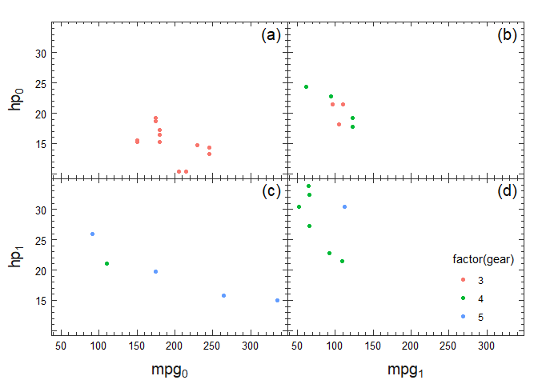
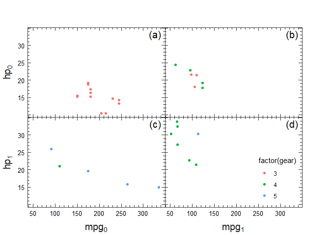
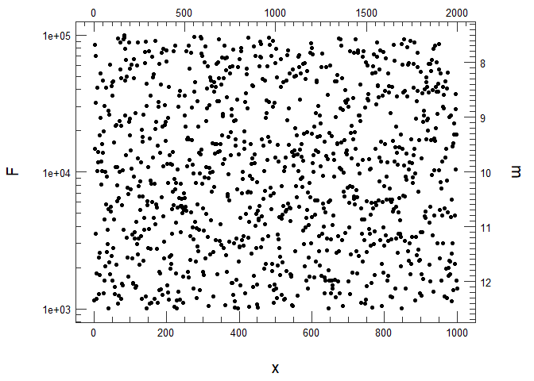

`sciplotr`
==========

`sciplotr` is built on the basis of
[`ggplot2`](https://github.com/tidyverse/ggplot2) (and includes parts of
the `ggplot2` distributed under
[`GPLv2`](https://github.com/tidyverse/ggplot2/blob/master/LICENSE)).

`sciplotr` provides versions of some `ggplot2` functions (like `theme`,
`facet`, `scale`) that produce more manuscript-oriented plots.

There are also extension methods to work with units (as in
[`grid`](https://github.com/cran/grid)’s `unit`).

Units support
-------------

    # {grid}'s way
    unit(5, "cm") + unit(1, "pt")

    ## [1] 5cm + 1pt

    # {sciplotr}'s way
    # Use `~` to define a single unit
    # Use `$` when doing arithmetic
    u_(5 ~ cm) + u_(1 ~ pt)

    ## [1] 5cm + 1pt

    u_(5$cm + 1$pt)

    ## [1] 5cm + 1pt

Function `u_` creates units and is best for hard-coded values, e.g.

    u_(1 ~ cm, 2 ~ `in`, 3 ~ pt, 4$mm + 8$mm)

    ## [1] 1cm       2in       3pt       4mm + 8mm

There is a similar `mar_` to create `margin` (which understands `top`,
`bot`, etc.). An accessor `at_` gives access to `margin`’s components by
their names in a `rlang`-ish way.

    # Set vertical margin to 5 cm and horizontal to 10 pt
    m <- mar_(v = 5 ~ cm, h = 10 ~ pt)
    at_(m, top) + at_(m, left)

    ## [1] 5cm + 10pt

`gtable`-like methods
---------------------

[`gtable`](https://github.com/r-lib/gtable) provides tools to manipulate
grobs. `sciplotr` has a few extra functions to inspect layout.
`postprocess_axes` is a handy method that sets up margins of a typical
`ggplot2` plot, that is, modifying heights/widths of axis name grobs,
axis ticks grobs and facet strips. It is possible to produce plots with
**exactly same** plot are size to nicely align them in the manuscript.

There are also some other tools of the family `get_grob_*`

Plotting
--------

`siplotr` has several main plotting-related methods that are derived
from `ggplot2`’s implementations.

-   `theme_sci` extends the space of theme parameters of `ggplot2`,
    adding several parameters, specific to `sicplotr`,
-   `coord_sci` is a copy of `coord_cartesian` (`CoordSci` derives from
    `CoordCartesian`), which explicitly plots minor axes ticks (using
    grid.minor breaks that can be displayed as grid lines, but not as
    ticks),
-   `scale_*[_log10]_sci` generate better tick positioning than default
    `ggplot2` methods, and work nicely with `coord_sci`,
-   `sec_axis_sci` and friends provide better support for secondary axes
    and secondary axes minor ticks,
-   `facet_sci` works similar to `ggplot2::facet_grid`, but applies
    different panel styling and also different strip labeling.

To warp things up, here is an example

    # Generate strip labels as list of expressions
    labeller <- label_f(
        .f_left = ~purrr::map(as.list(paste0("hp[", .x$rows$am, "]")), ~parse(text = .x)),
        .f_bottom = ~purrr::map(as.list(paste0("mpg[", .x$cols$vs, "]")), ~parse(text = .x)))

    # ggplot_sci is equivalent to ggplot() + theme_sci() + coord_sci()
    ggplot_sci(mtcars, aes(hp, mpg, col = factor(gear))) +
        theme_sci(ticks = -u_(5~pt), facet.lab.x = u_(0.93 ~ npc)) +
        geom_point() +
        scale_x_sci(name = NULL, sec.axis = dup_axis_sci_weak()) +
        scale_y_sci(name = NULL, sec.axis = dup_axis_sci_weak()) +
        facet_sci(am ~ vs, 
            labeller = labeller) -> plt
    print(plt)

    # This call generates plot with equal margin on all four sides (0.75 + 0.75 cm)
    grid.newpage()
    grid.draw(postprocess_axes(plt, 
        axes_margin = mar_(0.75 ~ cm), 
        text_margin = mar_(0.75 ~ cm, 0.75 ~ cm , 0 ~ npc, 0 ~ npc),
        strip_margin = mar_(0 ~ npc, 0 ~ npc, 0.75 ~ cm, 0.75 ~ cm)))

Another example shows different secondary axes scales. The main use case
is plots with sophisticated secondary axes, like astrophysical plots
where y-axis shows logarithmic fluxes (e.g. incident energy per unit
time, surface and frequency) and secondary y-axis shows “magnitudes”
(`2.5 * log10(F / F0)`).

    data <- data.frame(x = 1:1000, y = 10 ^ runif(1000, 3, 5));
    ggplot_sci(data, aes(x, y)) +
         geom_point() +
         scale_x_sci(sec.axis = sec_axis_sci(~2 * .)) +
         scale_y_log10_sci(name = "F",
            sec.axis = sec_axis_sci(
                ~ -2.5 * log10(.) + 20, 
                name = "m", 
                breaks_trans = identity_sci_trans()))

